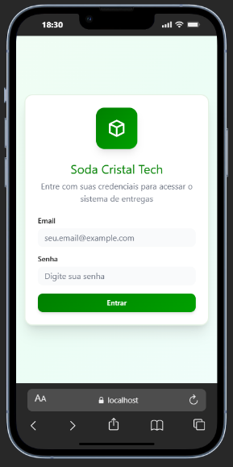
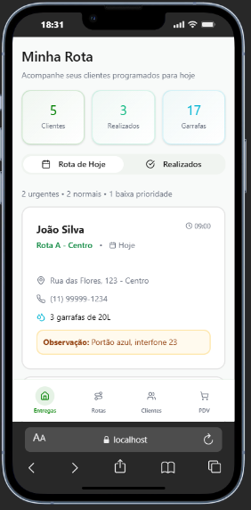

# Soda Cristal Tech App

> [!IMPORTANT]
> Aplicativo móvel de gestão de entregas e vendas para distribuidores de água com gás da Soda Cristal.

---

## 📋 Sobre o Projeto

Sistema de gestão focado em **vendedores/entregadores** da Soda Cristal, empresa de distribuição de garrafas de água com gás retornáveis, atuante em Mato Grosso do Sul e Cuiabá.

### Objetivo

Redesign completo do aplicativo móvel Android, desenvolvido como **webview** para execução no Android, consumindo a API Laravel existente.

---

## 🎨 Screenshots

### Tela de Login


### Tela de Rotas


---

## 🚀 Stack Tecnológica

| Camada | Tecnologia | Observações |
|--------|-----------|-------------|
| **Front-end** | React + Vite + TypeScript | Framework moderno e performático |
| **Estilização** | Tailwind CSS | Utility-first CSS framework |
| **Arquitetura** | Presentation/Domain/Shared | Clean Architecture |
| **Back-end** | API Laravel (existente) | Documentada e pronta para consumo |
| **Deploy** | Webview Android | APK Android |

---

## ✨ Principais Funcionalidades

### 📦 Gestão de Entregas e Rotas

#### Tela Inicial
- Visualização de entregas pendentes do dia
- Histórico de entregas concluídas
- Sincronização automática com painel administrativo

#### Rotas Programadas
- Listagem de clientes agendados por dia
- Informações de endereço e contato
- Status de conclusão em tempo real

### 📍 Check-in de Entregas

- ✅ Check-in com GPS ao chegar no local
- Registro de status variados:
  - ✅ Entrega realizada com sucesso
  - ❌ Cliente ausente
  - 🚫 Cliente recusou consumo
  - 📝 Outros status personalizados

### 💰 Registro de Vendas (PDV)

#### Tipos de Venda
- Vendas adicionais durante entregas (ex.: xaropes)
- PDV separado para vendas diretas

#### Formas de Pagamento
- 💳 Maquininha
- 📱 Pix
- 💵 Dinheiro

> [!NOTE]
> O aplicativo **não realiza transações financeiras**, apenas registra as vendas para gestão interna.

### 👥 Gestão de Clientes e Contratos

#### Cadastro de Clientes
- Cadastro completo de novos clientes pelo integrador
- Seleção de tipo de contrato:
  - Semanal
  - Quinzenal
  - Venda direta
  - Outros planos personalizados

#### Gestão de Contratos
- Geração automática de contrato
- Envio via WhatsApp para assinatura digital
- Aba dedicada para contratos aguardando assinatura

---

## 🛠️ Setup e Desenvolvimento

### Pré-requisitos

- Node.js 18+
- npm ou yarn

### Instalação

```bash
# Clonar o repositório
git clone <repository-url>

# Navegar até o diretório
cd soda-app

# Instalar dependências
npm install
```

### Executar Desenvolvimento

```bash
# Iniciar servidor de desenvolvimento
npm run dev
```

O aplicativo estará disponível em `http://localhost:5173`

### Build para Produção

```bash
# Gerar build otimizado
npm run build

# Preview do build
npm run preview
```

---

## 📁 Estrutura do Projeto

```
src/
├── presentation/       # Camada de UI
│   ├── pages/         # Páginas/rotas
│   ├── components/    # Componentes reutilizáveis
│   ├── layout/        # Layouts de página
│   └── hooks/         # Hooks de UI
├── domain/            # Regras de negócio
│   ├── auth/         # Autenticação
│   ├── deliveries/   # Entregas
│   ├── customers/    # Clientes
│   └── sales/        # Vendas
└── shared/            # Recursos compartilhados
    ├── api/          # Cliente HTTP
    ├── ui/           # Componentes genéricos
    ├── hooks/        # Hooks reutilizáveis
    └── utils/        # Utilitários
```

---

## 📚 Recursos e Documentação

### Links Importantes
- 🎨 [Figma Design](https://www.figma.com/design/cxyGldlvPLik23EjVm1v0Q/Soda-Cristal-Tech-App)
- 📚 Documentação API Laravel *(em desenvolvimento)*
- 🔧 Painel Administrativo *(acesso restrito)*

---

## 👥 Equipe

| Função | Nome | Responsabilidade |
|--------|------|------------------|
| **Desenvolvedor** | Ivan Martins | Implementação front-end |
| **Cliente** | Pedro Napoleão Jr. | Aprovação e validação |
| **Suporte Técnico** | Rafael | Handoff técnico e API |

---

## 📝 Status do Projeto

| Etapa | Status | Observações |
|-------|--------|-------------|
| **Design** | ✅ Aprovado | Figma finalizado |
| **Desenvolvimento** | 🔄 Em andamento | Implementação das telas |
| **Testes** | 🔜 Pendente | Aguardando conclusão |
| **Deploy** | 🔜 Pendente | A definir |

---

## 📄 Licença

© 2025 Soda Cristal. Todos os direitos reservados.

---

## 🤝 Contribuindo

Este é um projeto privado. Para contribuir, entre em contato com a equipe de desenvolvimento.